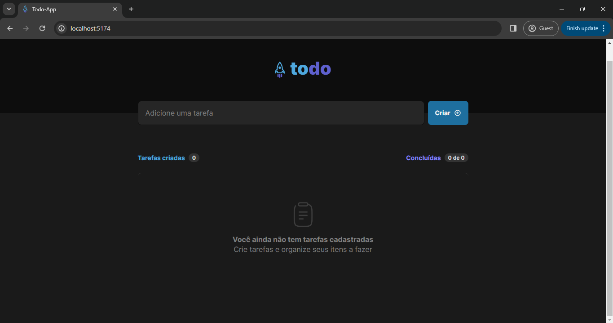
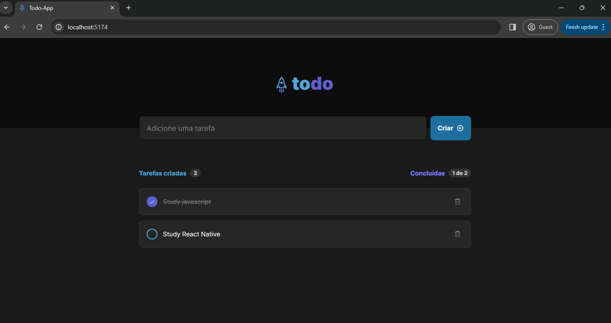

# Todo App

To-do list style task tracking application

## Layout

To see the complete layout: [figma](<https://www.figma.com/file/YqJC33tVzBSwFXxBpez52g/ToDo-List-%E2%80%A2-Desafio-React-(Copy)?type=design&node-id=4130-459&mode=design&t=pdVUT0FejANNKUEQ-0>)

<!-- image -->

<div align="center" style="display:flex">
    
    
</div>

## Features

- [x] Add a new task
- [x] Mark and unmark a task as completed
- [x] Remove a task from the list
- [x] Show task completion progres

## What was used ?

The project was created on react

- [x] ReactJs
- [x] Css modules
- [x] Typescipt

## For Run

With YARN:

```
yarn
yarn dev
```

With NPM

```
npm install
npm run dev
```
